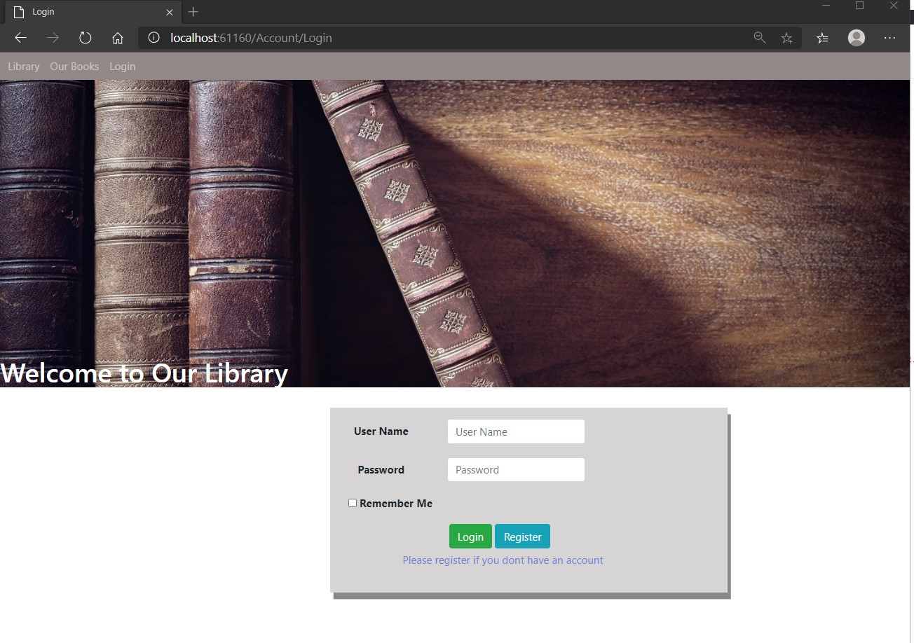
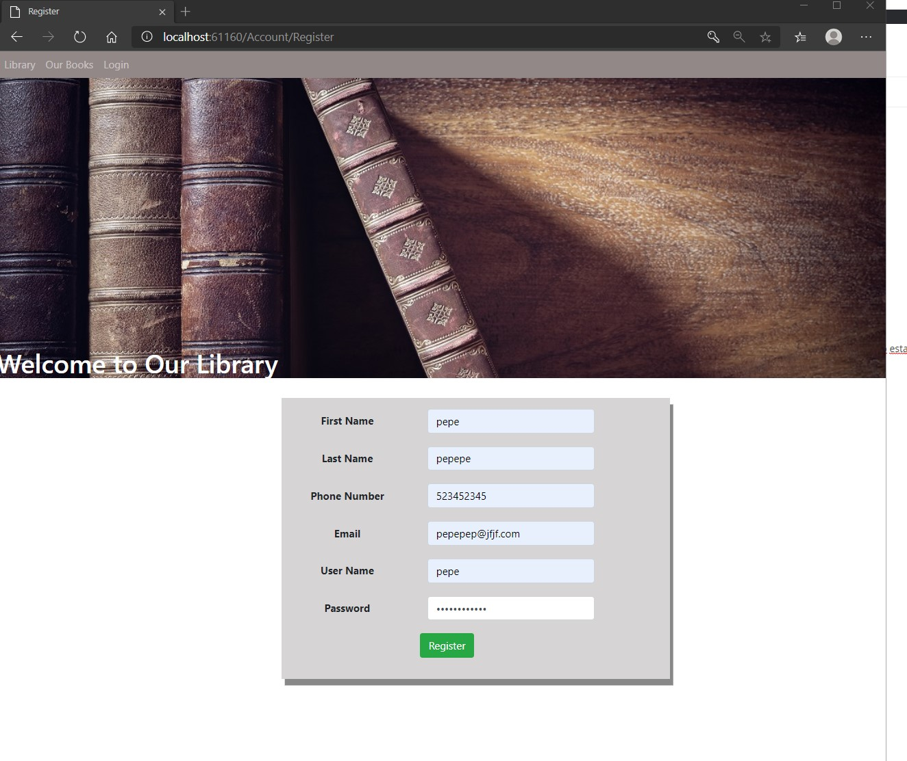
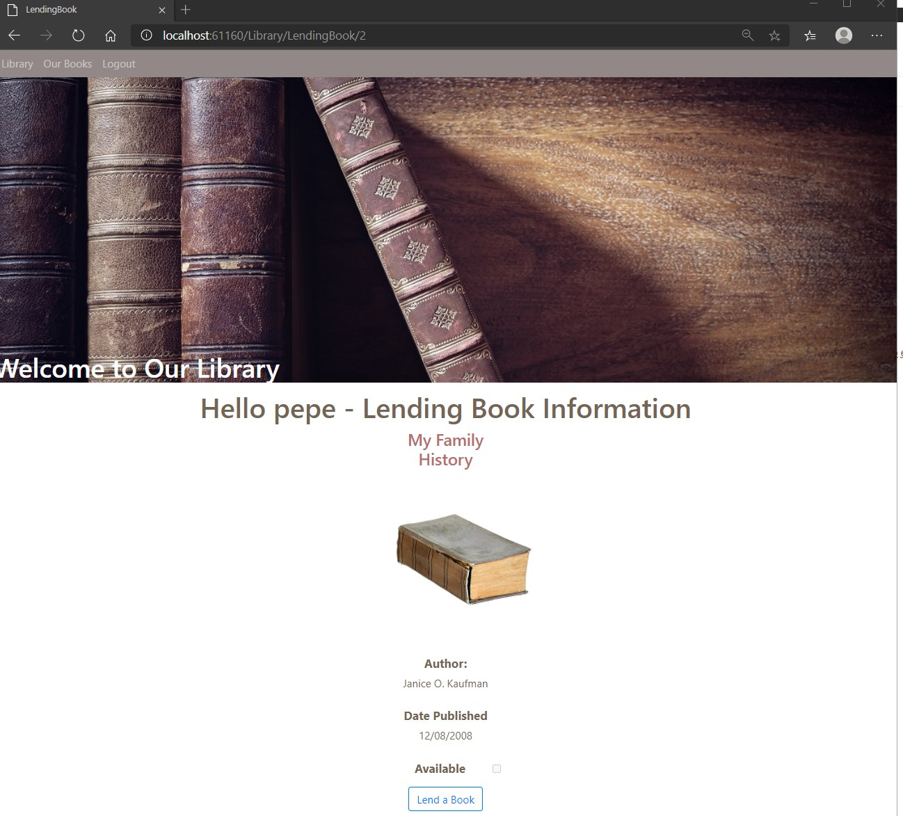
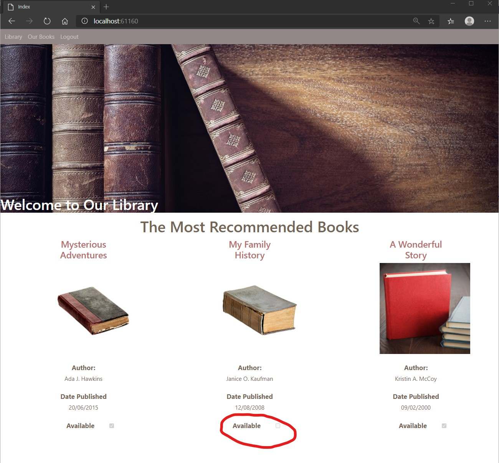

# Module 11: Managing Security

## Lab: Managing Security

1. **Nombres y apellidos:** Francisco Javier Moreno Quevedo
2. **Fecha:** 02/12/2020
3. **Resumen del Ejercicio:** implementarla seguridad en el proyecto 1/3
4. **Dificultad o problemas presentados y como se resolvieron:** Ninguna

Ejercicio 1: Use Identity

- Añadimos las depnedencias al proyecto con npm Install

- La clase user la heredamos de IdentityUser

- La clase LibraryContext la heredamos de IdentityDbContext<User>

- En el middleware lo configuramos para que acepte la autenticacion

- Creamos el controlador de cuentas AccountController

- La vista de LendingBook le añadimos la informacion de la persona logadas

- La vista _layout.cshtml incluimos la autenticacion por role y el control de si el usuario esta logado

- Ejecutamos

  

